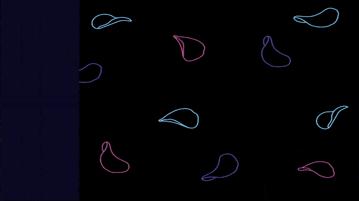
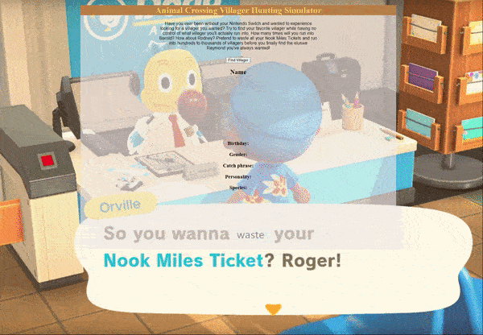
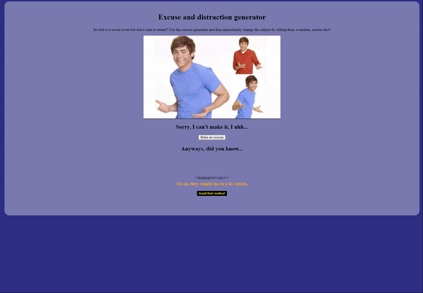

### Hello there. I'm Albert, aka the #potatoDev! Welcome to my GitHub. 👋

<!--
**thePotatoDev-git/thePotatoDev-git** is a ✨ _special_ ✨ repository because its `README.md` (this file) appears on your GitHub profile.

Here are some ideas to get you started: -->

- 🖥️ I just finished a website for a client. Check it out! ([Minds Inspired Counseling](https://github.com/thePotatoDev-git/freelance-client-sites/tree/master/Minds%20Inspired%20Counseling))
- 👓 I’m currently learning backend development.
- 📂 Check out my portfolio at ([thePotatoDev.netlify.app](https://thepotatodev.netlify.app/))
- 📫 How to reach me: albertus.chua@gmail.com
- 🥔 Fun fact: I love potato chips. Like, I always want chips. Please give me chips.

<h1 align="center">Projects</h1>
<table bordercolor="#66b2b2">
  
  <tr>
    <td width="50%" valign="top">
      <h3 align="center">Portfolio Page</h3>
         
        
         
        

          
  
      

        
<strong>HTML, CSS, JavaScript</strong> - My portfolio showcasing some of the work I've done, along with ways to get in touch with me.

    </td>
    <td width="50%" valign="top">
      <h3 align="center">NASA Picture of the Day</h3>
         
      
         
        

          
  
  
      

        
<strong>HTML, CSS, JavaScript, APIs</strong> - An API project that shows NASA's picture of the day. Simply enter a date, and it will populate the page with a picture and description.

    </td>
  </tr>
  
  <tr>
    <td width="50%" valign="top">
      <h3 align="center">Animal Crossing Villager Hunting Simulator</h3>
       
        
       
        

  
  
      

        
<strong>HTML, CSS, JavaScript</strong> - Simulate looking for your favorite Animal Crossing villager with this simulator. Just press the "Find Villager" button to look for your villager!

    </td>
    <td width="50%" valign="top">
      <h3 align="center">Excuse and Distraction Generator</h3>
         
        
         
        

          
  
  
      

        
<strong>HTML, CSS, JavaScript, APIs</strong> - Have a social event you don't wanna go to? Generate an excuse to not go and quickly change the subject with a useless fact!

    </td>
  </tr>
</table>
            
<h1 align="center">Languages and Tools:</h1>

 <a href="https://www.w3.org/html/" target="_blank" rel="noreferrer">      </a>     

<h1 align="center">Codewars Rank</h1>

https://www.codewars.com/users/thePotatoDev

