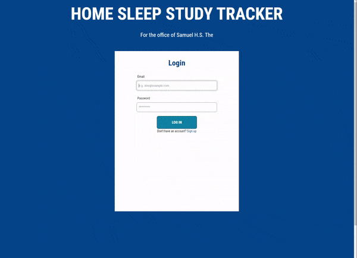
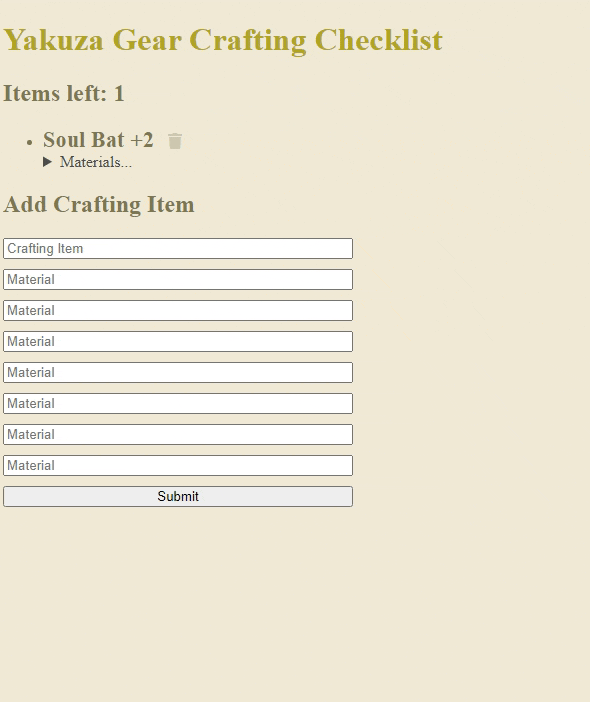

### Hello there. I'm Albert, aka the #potatoDev! Welcome to my GitHub. 👋

<!--
**thePotatoDev-git/thePotatoDev-git** is a ✨ _special_ ✨ repository because its `README.md` (this file) appears on your GitHub profile.

Here are some ideas to get you started: -->

- 🖥️ I just finished version 1.0 of my home sleep study tracker. ([Repo](https://github.com/thePotatoDev-git/sleep-study-tracker))
- 👓 I’m currently learning React. :atom:
- 📂 Check out my portfolio at ([thePotatoDev.netlify.app](https://thepotatodev.netlify.app/)) or scroll down further for a showcase of some of the project I've created.
- 📫 How to reach me: albert.thepotatodev@gmail.com
- 🥔 Fun fact: I love potato chips. Send me potato chip suggestions, thank you.

<h1 align="center">Languages and Tools:</h1>

 <a href="https://www.w3.org/html/" target="_blank" rel="noreferrer">      </a>     

<h1 align="center">Projects</h1>

<i>*Please note after Heroku's new paid tiers, some of my projects are currently unavailable. I am working on transferring them to a new host. Thank you for your understanding!</i>

<table bordercolor="#66b2b2">
  
  <tr>
  <td width="50%" valign="top">
      <h3 align="center">Summit Medical Sleep Study Tracker</h3>
         
        
         
        

          
  
  
      

        
<strong>HTML, CSS, Tailwind, JavaScript, Node.js, Express, MongoDB</strong> - A sleep study tracker created for a sleep doctor's private practice. Keep track of patient sleep studies coming in, and assign studies to sleep techs.

    </td>
    <td width="50%" valign="top">
      <h3 align="center">Ordinary Gamers' Crafting App</h3>
         
        
         
        

          
  
  
      

        
<strong>HTML, CSS, JavaScript, Node.js, Express, MongoDB</strong> - Made for the Ordinary Gamers club, keep track of crafting items you want to make in a videogame along with the materials that are needed.

    </td>
    
  </tr>
  
  <tr>
  <td width="50%" valign="top">
      <h3 align="center">Bergen County Astronomers POTD App</h3>
         
        
         
        

          
  
  
      

        
<strong>HTML, CSS, JavaScript, APIs</strong> - An app for the Bergen County Astronomers Club that shows the picture of the day using NASA's API. Simply enter a date, and it will populate the page with a picture and description.

    </td>
    <td width="50%" valign="top">
      <h3 align="center">What's for Dinner?</h3>
       
        
       
        

  
  
      

        
<strong>HTML, CSS, JavaScript</strong> - Having trouble deciding what to have for dinner tonight? Choose between two eateries, and narrow it down to a single winner!

    </td>
  </tr>
</table>
            

